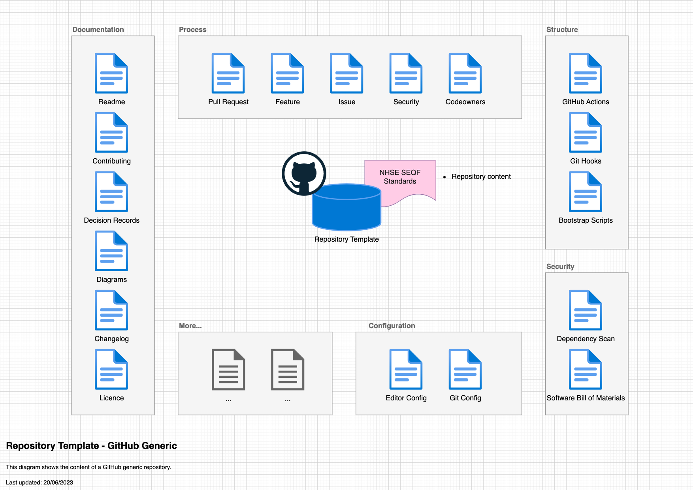

# NHS Notify

[](https://github.com/NHSDigital/nhs-notify/actions/workflows/cicd-1-pull-request.yaml)

NHS Notify - for the NHS Notify web site, onboarding guidance, and customer support, please visit the [NHS Service Catalogue](https://digital.nhs.uk/services/nhs-notify).

## Who/what is this repository is for?

- NHS Developers working on NHS Notify
- Those who are interested in how NHS Notify is architected and developed.

## Who/what is this repository not for?

- Customer Support
- Supplier Support

## Table of Contents

- [NHS Notify](#nhs-notify)
  - [Who/what is this repository is for?](#whowhat-is-this-repository-is-for)
  - [Who/what is this repository not for?](#whowhat-is-this-repository-not-for)
  - [Table of Contents](#table-of-contents)
  - [Documentation](#documentation)
  - [Setup](#setup)
    - [Prerequisites](#prerequisites)
    - [Configuration](#configuration)
  - [Usage](#usage)
  - [Design](#design)
    - [Diagrams](#diagrams)
    - [Modularity](#modularity)
  - [Contributing](#contributing)
  - [Contacts](#contacts)
  - [Licence](#licence)

## Documentation

- [Built](https://nhsdigital.github.io/nhs-notify/)
- [Source](/docs/README.md)

## Setup

Clone the repository

```shell
git clone https://github.com/NHSDigital/nhs-notify.git
cd nhs-notify
code project.code-workspace
```

### Prerequisites

### Configuration

## Usage

## Design

### Diagrams

The [C4 model](https://c4model.com/) is a simple and intuitive way to create software architecture diagrams that are clear, consistent, scalable and most importantly collaborative. This should result in documenting all the system interfaces, external dependencies and integration points.



### Modularity

Most of the projects are built with customisability and extendability in mind. At a minimum, this can be achieved by implementing service level configuration options and settings. The intention of this section is to show how this can be used. If the system processes data, you could mention here for example how the input is prepared for testing - anonymised, synthetic or live data.

## Contributing

Describe or link templates on how to raise an issue, feature request or make a contribution to the codebase. Reference the other documentation files, like

- Environment setup for contribution, i.e. `CONTRIBUTING.md`

## Contacts

## Licence

Unless stated otherwise, the codebase is released under the MIT License. This covers both the codebase and any sample code in the documentation.

Any HTML or Markdown documentation is [© Crown Copyright](https://www.nationalarchives.gov.uk/information-management/re-using-public-sector-information/uk-government-licensing-framework/crown-copyright/) and available under the terms of the [Open Government Licence v3.0](https://www.nationalarchives.gov.uk/doc/open-government-licence/version/3/).
