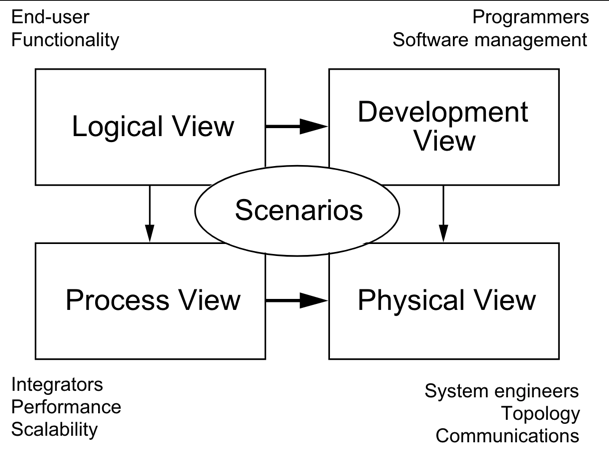

Be aware of NHS organizational
standards: [NHS Architecture Principles][nhsap] | [Software Engineering Quality Framework][seqf] |
[Records Management Code of Practise][rmc]

[nhsap]: https://digital.nhs.uk/about-nhs-digital/our-work/nhs-digital-architecture/principles#download-the-nhs-architecture-principles

[seqf]: https://github.com/NHSDigital/software-engineering-quality-framework

[rmc]:https://transform.england.nhs.uk/information-governance/guidance/records-management-code/

## General principles for diagrams

* Pages are structured using the [4+1 View of Architecture][Kruchten]
  and flow from high level to broken down functionality.
* Final "view" documentation is meant to represent the "current" view
  of the system, not work in progress
* Diagram checklist to help with consistency:
  1. Diagrams flow from left to right, then top to bottom to allow
     readability
  2. 0.5 line and shape width
  3. lines are recommended to have text (and preferably numbered)
  4. provide context on which part of the system the diagram relates
     to

[<figcaption>Architectural Blueprints—The “4+1” View Model of Software Architecture</figcaption>][Kruchten]

[Kruchten]: https://ics.uci.edu/~michele/Teaching/INF117/Krutchten%204+1View%20SWArch.pdf

* Physical
  * [Sub-domains and bounded contexts](physical/sub-domains_and_bounded_contexts)
  * [Initial account structure for new architecture](physical/initial_account_structure_for_new_architecture)
