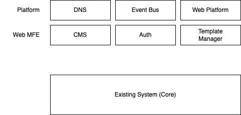

## Initial account structure for new architecture

* The initial accounts have been created reflect the structure we
  intend to use for the new Web UI
  * A top-level DNS sub-domain provides the mapping from the nhsnotify
    DNS root to delegated DNS zones in each sub-domain account
  * The Event Bus account provides a central location for events to be
    published without the consuming services needing direct knowledge
    of the source
  * The Web Platform account provides the endpoint for the Web UI and
    documentation. It delegates requests to the other micro-frontend (
    MFE) services
* Each MFE (micro-frontend) is implemented in its own sub-domain.
  Initially these will be:
  * CMS: Service documentation. This may be hosted on GitHub pages in
    which case it may not have its own domain accounts
  * Auth: Federated login identity provider which will provide tokens
    for use across the other MFE services
  * Template Manager: MVP template manager web UI
* The existing system, while it consists of several conceptual
  domains, is currently deployed to a single account
  * As we refine the architecture we will extract sub-domains from the
    core system and create new accounts to encapsulate them.

