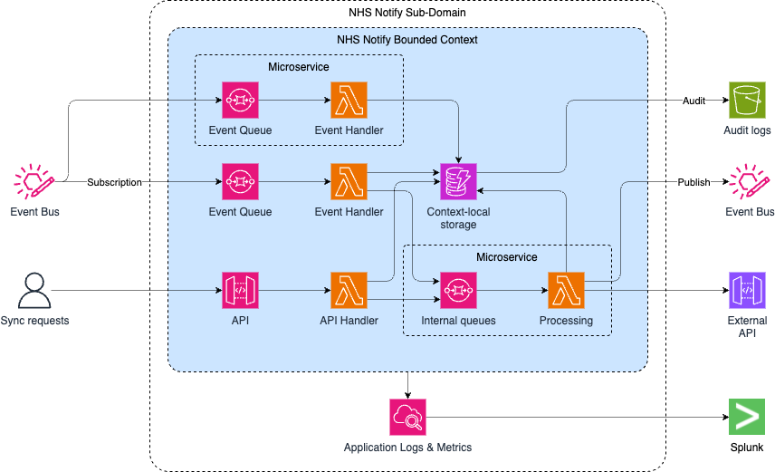

# Sub-domains and bounded contexts

[Bounded contexts][1] are a pattern used in DDD to model parts of a
system which operate on a single consistent model of part of a
business domain.

[1]: https://martinfowler.com/bliki/BoundedContext.html

For NHS Notify we are attempting to keep our architecture modular
following DDD principles. As a starting point when creating new
bounded contexts these are some suggestions for structuring the AWS
accounts and components which are deployed within them.

* By default, each sub-domain has its own AWS accounts
  * `<sub-domain>-preprod` (AKA `dev`)
  * `<sub-domain>-prod`
* Each sub-domain will have a top-level GitHub repo which defines the
  account-level infrastructure
* Each sub-domain will have one or more bounded contexts
  * Usually this revolves around some store of state
  * Subscriptions for events which affect that state
  * Handlers and processing for changes to state
  * APIs for direct actions on the state
  * Events published to reflect changes to the state
  * Auditing and logging to wrap the service and provide observability
* A sub-domain may contain one or more microservices
  * Each microservice should be individually deployable with defined
    contracts between services
  * Each microservice should be contained in its own GitHub repo
* Questions:
  * Where are audit logs kept? Per sub-domain, or shared location in
    isolated account?

