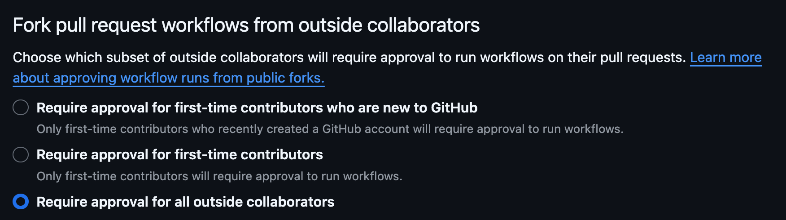

When setting up a new GitHub repository for use with NHS Notify, we use a standard set of configuration options to
ensure consistency and security.

This guide follows the NHSE Software Engineering Quality Framework, in particular the following pages are useful:

* [Securing Repositories](https://github.com/NHSDigital/software-engineering-quality-framework/blob/main/practices/securing-repositories.md#securing-repositories)
* [Continuous Integration](https://github.com/NHSDigital/software-engineering-quality-framework/blob/main/practices/continuous-integration.md)

## Codeowners

Following
the [SEQF guidance](https://github.com/NHSDigital/software-engineering-quality-framework/blob/main/practices/securing-repositories.md#teams-setup),
the default code owner should be the GitHub team with write access to the repository.

In addition, due to the multi-repository structure of the codebase, the CODEOWNERS files themselves are protected by
requiring approval from a project-wide nhs-notify-code-owners team.

For example:

```codeowners
# Default codeowner should be a team with write access
*                     @NHSDigital/nhs-notify-amet

# Default protection for codeowners, must be last in file
/.github/CODEOWNERS   @NHSDigital/nhs-notify-code-owners
/CODEOWNERS           @NHSDigital/nhs-notify-code-owners
```

Individual teams are encouraged to include additional codeowners for any sub-components of their repository which
require additional scrutiny.

## Runners

* [Do not use private runners for public repos](https://docs.github.com/en/actions/hosting-your-own-runners/managing-self-hosted-runners/about-self-hosted-runners#self-hosted-runner-security)
* We will use GitHub hosted runners for CI in all public repos
* We will also use GitHub hosted runners for private repos unless we have a good reason that a private runner is needed

## Branch Protection Rules

* Allow Squash merges - this should be the default merge type for feature branches
* Allow merge commits - this may be required for release or hotfix branches to be merged back to main
* Require signed commits
* Optional: merge queues may be used if merge frequency causes issues for a repository
* Use branch protection rules - rulesets are currently not recognised by the engineering quality dashboard
  * `main` branch should be protected from deletion
  * Require a pull request before merging
  * Require approvals
  * Dismiss stale pull request approvals when new commits are pushed
  * Require review from Code Owners
  * Require approval of the most recent reviewable push
  * Require status checks to pass before merging
  * Require conversation resolution before merging
  * Require signed commits

## Pull requests for public repos

* [Pull requests from forked repos should be configured to require a maintainer to approve the workflow run for all outside contributors](https://docs.github.com/en/repositories/managing-your-repositorys-settings-and-features/enabling-features-for-your-repository/managing-github-actions-settings-for-a-repository#controlling-changes-from-forks-to-workflows-in-public-repositories)
* Workflow runs for PRs from forked repos run with READ_ONLY permission by default, which means they do not have access
  to secrets and cannot make any modifications to the base repo.



## Bootstrapping CI/CD

* Public repositories should not directly invoke CD workflows, and should delegate to a private deployment repository.
* [CD workflows should be granted access to an AWS deployment role via OIDC](https://docs.github.com/en/actions/deployment/security-hardening-your-deployments/configuring-openid-connect-in-amazon-web-services)
  * IAM allows a new OIDC identity provider to be registered with an account
  * A role must be created with a trust policy allowing the GitHub repo token to assume the role.
  * [Example of assuming a role using OIDC in an Actions workflow](https://medium.com/@thiagosalvatore/using-terraform-to-connect-github-actions-and-aws-with-oidc-0e3d27f00123)
  * The set up of the necessary OIDC provider can be applied via Terraform
  * This step is likely to require local deployment, although it's possible we could apply the changes from inside the AWS
    console using cloudshell - TBD
* Workflow files should be protected by the CODEOWNERS file to prevent unexpected modifications

## CI Workflows

* CI workflows should not require access to secrets
* CI workflows should not require access to AWS resources
* Component tests should use locally provisioned resources (docker containers or similar) or in-process test harnesses
  to provide mock services
* Contract tests should be implemented the same way
* Micro-benchmarks on the service should be implemented the same way

## CD Workflows

* Deployment workflows may be triggered by users with appropriate access to the repository
* Deployment workflows should be configured to work with the GitHub environments feature
* [Deployment rules should be set appropriately for the environment being deployed](https://docs.github.com/en/actions/deployment/targeting-different-environments/using-environments-for-deployment#deployment-protection-rules)
* Any secrets required for deployment should be set at the environment level. These will not be made available to any
  workflows unless the deployment is approved

## Post-deployment Workflows

* Post-deployment workflows should be triggered after CD workflows or manually as needed
* These workflows should be scoped to an environment in the same way as CD workflows
* For individual services the post-deployment workflows should test behaviour at the domain boundary
* E.g. the test should replay a scenario and subscribe to output events to ensure the behaviour is as expected
* Service level benchmarking could be performed at this point in non-production environments
* Full-platform end-to-end and performance tests should live in a separate repository

## Artifacts and Releases

* Artifacts for each build should be packaged and available from the CI pipeline output
* These are available for 90 days in public repos (could be extended to 400 days in private repos)
* When a tag is created, a release corresponding to that tag should publish the packaged artifacts
* Deployment pipelines should either be triggered from a branch or a tag
* When triggered from a branch, the most recent build for that branch should be used as the source of the artifacts
* When triggered from a tag, the published release artifacts should be used
